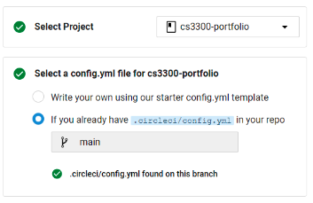
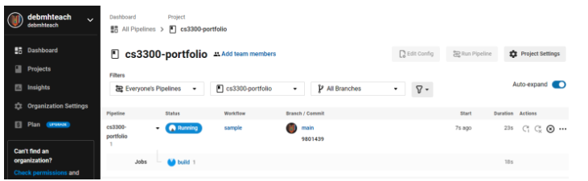
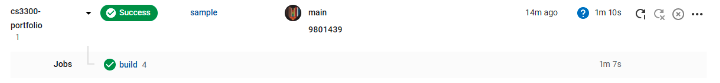
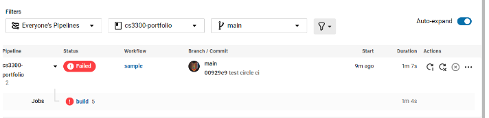

# Rails - Devise User Authentication

### Step 1 - Change directories into your portfolio application <br>
    `cd <Your application name>`

### Step 2 - Create a Landing/ Index page

1. Begin by adding a route to the routes.rb file found in config/routes.rb
2. Modify the root command previously added to the file to now state <br>
`root to: "home#index`
3. Next, create the app/controllers/home_controller.rb file and add ALL of the following code.

```ruby
# This is a basic HomeController with an index that does one thig: render 
# the view file associated with the controller action

class HomeController < ApplicationController
    def index
        render
    end
end
   ```

4. Create a new directory in the app/views directory. Run this in the command line.<br>
`mkdir app/views/home/`
5. Create a new html file in the app/views/home/ directory<br>
`touch app/views/home/index.html.erb`
6. Add the following to the file you just created <br>
`<h1> Hello World, This is the homepage of my application!</h1>`
7. Start the rails server with the following command on the command line <br>
`rails s -b 0.0.0.0`
8. View the changes that you made by navigating to http://localhost:3000/

### Step 3 - Installing and Configuring Devise

1. Add the devise gem to your Gemfile after gem "rails" <br>
   `gem "rails" , "~> 7.0.3"` <br>
   `gem "devise"`
2. Refresh/ install all the gems in your project<br>
`bundle install`
3. Set up devise in your project by running the generator command to create all the necessary logic and views 
associated with devise<br>
`bundle exec rails g devise:install`
4. Open config/initializers/devise.rb and add the following line of code. Make sure that the code is within the devise 
setup loop. Your code should look something like the following. **The line of code should be added somewhere around line 19.**<br>
```ruby
Devise.setup do |config|
    # ... comments...

    config.navigational_formats = ['*/*', :html, :turbo_stream]

    # ... comments...
end
```
5. Open app/views/layouts/application.html.erb and add the following code inside the HTML body tags.<br>
```Ruby
# Your code should look something like this
...
<body>
    <p class="notice"><%= notice %></p> 
    <p class="alert"><%= alert %></p> 
    <%= yield %>
</body>
```

### Step 4 - Create the User model with Devise
1. Run the following generator command to generate the devise user model<br>
`bundle exec rails g devise user`
2. Confirm that the following code exists within your config/routes.rb file **above** the code for `root "home#index` if it does not exist, make sure to add it.<br>
```ruby
    devise_for :users
```
3. **[OPTIONAL]** - To view all the available routes, we can run the following command and get an output in the command line of all possible routes that we can provide to the user<br>
`bundle exec rails routes`
4. Make all the database migrations and place the user's table in the database<br>
`bundle exec rake db:migrate`
5. At this point you can re-start your rails server by stopping it with *ctrl + c*  and restarting with the following command <br>
`rails s -b 0.0.0.0`
6. View the changes that you made by navigating to http://localhost:3000/
7. If you don't see changes, that's okay! now navigate to http://localhost:3000/users/sign_up and you should see a new user registration form!

### Step 5 - Modifying the Landing Page
1. Open the app/views/home/index.html.erb file and replace the contents of the file with the following
```HTML
<!DOCTYPE html>
<html lang="en">
  <head>
    <meta charset="UTF-8">
    <meta name="viewport" content="width=device-width, initial-scale=1.0">
    <meta http-equiv="X-UA-Compatible" content="ie=edge">
    <title>CS3300 Portfolio Project</title>

  </head>
  
  <body>
    <div style="margin: 5% 0 0 10%;">
    <h1>Projects</h1>   
    <h1>CS 3300 Portfolio Project - Fall 2022</h1>

      <div style="padding-left: 2rem;">
        <h4 style="color: blue"> [Replace your name here] </h3>
        

        <!--- Explain what the block of code below this line is doing --->

        <% if user_signed_in? %>
          
          <div> Welcome <%= current_user.email %> </div>
          <%= button_to "Sign out", destroy_user_session_path, method: :delete %> 
        
        <% else %>
          <a href="/users/sign_in"> Sign in</a>
        <% end %>

      </div>
    </div>
  </body>
</html>
```

2. Modify the code to include your name where it says **[Replace your name here]** around line 16.<br>
3. View the changes you have made by navigating to http://localhost:3000/ <br>

<hr>

# CircleCI Setup
### Continuous Integration Continuous Delivery Pipeline

### Step 1 - Configuring circleCI in the project
1. In your application's directory, create a new directory with name `.circleci` (including the period at the beginning 
of the name)<br>
`mkdir .circleci`
2. Create a new file inside the directory titled **config.yml**<br>
`touch .circleci/config.yml`
3. Copy and paste the following contentment from below into the config.yml file<br>
```YML
# Use the latest 2.1 version of CircleCI pipeline process engine.
# See: https://circleci.com/docs/2.0/configuration-reference
version: 2.1
jobs:
  build:
    docker:
      - image: 'tghastings/code-esaas'
    steps:
      - checkout
      - run:
          name: rspec
          command: sed -i 's/ruby "[0-9].[0-9].[0-9]"/ruby "3.0.2"/' Gemfile && bundle install && bundle exec rake db:migrate RAILS_ENV=test && bundle exec rspec
# Invoke jobs via workflows
# See: https://circleci.com/docs/2.0/configuration-reference/#workflows
workflows:
  sample: # This is the name of the workflow, feel free to change it to better match your workflow.
    # Inside the workflow, you define the jobs you want to run.
    jobs:
      - build
```
4. You will need to push your code to Github

### Step 2 - Setting up a CircleCI account
1. Go to https://circleci.com and Sign-in with GitHub
   1. Accept the Authorization of Circle CI (you'll be re-directed to GitHub and then back to CircleCI)
2. Select the repository for your portfolio project (this should be listed in CircleCI's interface)<br>

   1. You may see the CI/CD pipeline in action and start to run your tests (it should look something like the image below)<br>
   
3. Push your code with unit tests to GitHub
4. Verify that you can see your tests passing on https://app.circleci.com/pipelines/github/<GITHUB_USERNAME>/<PROJECT_NAME> <br>
   1. 
5. Make changes to the code in your project.rb file so that the tests will fail Do this by commenting out `validate_presence_of`<br>
```
class Project < ApplicationRecord
    # require title and description
    #validates_presence_of :title, :description
end
```
6. Push your modified code back to GitHub and navigate back to your project in CircleCI https://app.circleci.com/pipelines/github/<GITHUB_USERNAME>/<PROJECT_NAME> <br>
7. See that your tests failed
   
8. Click on the small triangle left of the red <span style="color:red;">FAILED</span> icon.<br>
9. Click on the blue <span style="color:#00BFFF;">build</span> link.
10. Expand the rspec box to view the test output.
    
11. Revert the changes you just made in the project.rb file and uncomment the `validates_presence_of` line
```
class Project < ApplicationRecord
     # require title and description
    validates_presence_of :title, :description
end
```
12. Push your code back to GitHub and re-check CircleCI to ensure that all the tests pass again<br>


### Note: If your tests are not all passing and CircleCI does not show "Successful" this is OK
