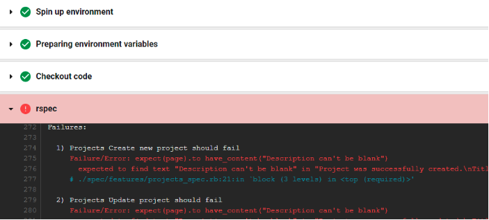

# Rails - Devise User Authentication

Here you will set up a user login.

Go to your Portfolio project docker environment and cd to your portfolio project directory.


### Step 1 - Installing and Configuring Devise

1. Add the devise gem to your Gemfile after gem "rails" <br>
   `gem "rails" , "~> 6.1.7"` <br>
   `gem "devise"`
2. Refresh/ install all the gems in your project<br>
`bundle install`
3. Set up devise in your project by running the generator command to create all the necessary logic and views 
associated with devise<br>
`bundle exec rails g devise:install`
4. Open config/initializers/devise.rb and add the following line of code. Make sure that the code is within the devise 
setup loop. Your code should look something like the following. **The line of code should be added somewhere around line 19.**<br>
```ruby
Devise.setup do |config|
    # ... comments...

    config.navigational_formats = ['*/*', :html, :turbo_stream]

    # ... comments...
end
```

5. Run the following generator command to generate the devise user model<br>
`bundle exec rails g devise user`
6. Confirm that the following code exists within your config/routes.rb file **above** the code for `root "home#index` if it does not exist, make sure to add it.<br>
```ruby
     devise_for :users
     root "projects#index"
     resources :projects
```
7. To view all the available routes, we can run the following command and get an output in the command line of all possible routes that we can provide to the user<br>
`bundle exec rails routes`
8. Make all the database migrations and place the user's table in the database<br>
`bundle exec rake db:migrate`

9. Generate the views associated with devise by running the following command.
#rails generate devise:views users

10. In /config/initializer/devise.rb, Uncomment the following around line 255 # config.scoped_views = false 
    change false to true
     # config.scoped_views = ftrue 

11. Open app/controllers/projects_controller.rb and update the following
```Ruby
class ProjectsController < ApplicationController
  before_action :set_project, only: %i[ show edit update destroy ]
  before_action :authenticate_user!, only: %i[ new edit update destroy]
 ```

10. Open app/views/layouts/application.html.erb and add the following code inside the HTML body tags.<br>
```Ruby
# Your code should look something like this
...
  <body>
  <p class="navbar-text float-right">
  <% if user_signed_in? %>
    Logged in as <strong><%= current_user.email %></strong>.
    <%= link_to 'Edit profile', edit_user_registration_path, :class => 'navbar-link' %> |
    <%= link_to "Logout", destroy_user_session_path, method: :delete, :class => 'navbar-link'  %>
  <% else %>
    <%= link_to "Sign up", new_user_registration_path, :class => 'navbar-link'  %> |
    <%= link_to "Login", new_user_session_path, :class => 'navbar-link'  %>
  <% end %>
  </p>
  <p class="notice"><%= notice %></p> 
  <p class="alert"><%= alert %></p> 
    <%= yield %>
  </body>
```

11. At this point you can re-start your rails server by stopping it with *ctrl + c*  and restarting with the following command <br>
`rails s -b 0.0.0.0`
12. View the changes that you made by navigating to http://localhost:3000/

13. Open the app/views/projects/index.html.erb file and update to only show edit destroy buttons if logged in
```HTML
        <div class="btn-group" role="group" aria-label="Basic example">       
        <%= link_to 'Show', project, class:"btn btn-outline-primary"%>
        <% if user_signed_in? %>
          <%= link_to 'Edit', edit_project_path(project), class:"btn btn-outline-primary" %>
          <%= link_to 'Destroy', project, method: :delete, data: { confirm: 'Are you sure?' }, class:"btn btn-outline-primary" %>
        <% end %>  
        </div>
```
3. View the changes you have made by navigating to http://localhost:3000/ <br>

<hr>

# CircleCI Setup
### Continuous Integration Continuous Delivery Pipeline

### Step 1 - Configuring circleCI in the project
1. In your application's directory, create a new directory with name `.circleci` (including the period at the beginning 
of the name)<br>
`mkdir .circleci`
2. Create a new file inside the directory titled **config.yml**<br>
`touch .circleci/config.yml`
3. Copy and paste the following contentment from below into the config.yml file<br>
```YML
# Use the latest 2.1 version of CircleCI pipeline process engine.
# See: https://circleci.com/docs/2.0/configuration-reference
version: 2.1
jobs:
  build:
    docker:
      - image: 'tghastings/code-esaas'
    steps:
      - checkout
      - run:
          name: rspec
          command: sed -i 's/ruby "[0-9].[0-9].[0-9]"/ruby "3.0.2"/' Gemfile && bundle install && bundle exec rake db:migrate RAILS_ENV=test && bundle exec rspec
# Invoke jobs via workflows
# See: https://circleci.com/docs/2.0/configuration-reference/#workflows
workflows:
  sample: # This is the name of the workflow, feel free to change it to better match your workflow.
    # Inside the workflow, you define the jobs you want to run.
    jobs:
      - build
```
4. You will need to push your code to Github

### Step 2 - Setting up a CircleCI account
1. Go to https://circleci.com and Sign-in with GitHub
   1. Accept the Authorization of Circle CI (you'll be re-directed to GitHub and then back to CircleCI)
2. Select the repository for your portfolio project (this should be listed in CircleCI's interface)<br>

   1. You may see the CI/CD pipeline in action and start to run your tests (it should look something like the image below)<br>
   
3. Push your code with unit tests to GitHub
4. Verify that you can see your tests passing on https://app.circleci.com/pipelines/github/<GITHUB_USERNAME>/<PROJECT_NAME> <br>
   1. 
5. Make changes to the code in your project.rb file so that the tests will fail Do this by commenting out `validate_presence_of`<br>
```
class Project < ApplicationRecord
    # require title and description
    #validates_presence_of :title, :description
end
```
6. Push your modified code back to GitHub and navigate back to your project in CircleCI https://app.circleci.com/pipelines/github/<GITHUB_USERNAME>/<PROJECT_NAME> <br>
7. See that your tests failed
   
8. Click on the small triangle left of the red <span style="color:red;">FAILED</span> icon.<br>
9. Click on the blue <span style="color:#00BFFF;">build</span> link.
10. Expand the rspec box to view the test output.
    
11. Revert the changes you just made in the project.rb file and uncomment the `validates_presence_of` line
```
class Project < ApplicationRecord
     # require title and description
    validates_presence_of :title, :description
end
```
12. Push your code back to GitHub and re-check CircleCI to ensure that all the tests pass again<br>


### Note: If your tests are not all passing and CircleCI does not show "Successful" this is OK
